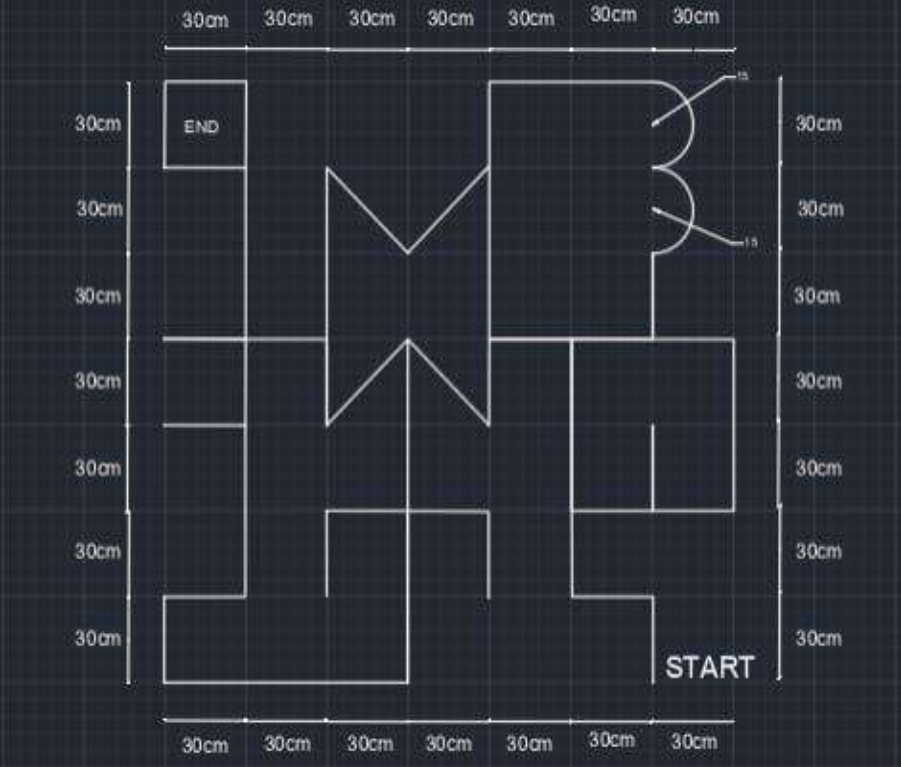
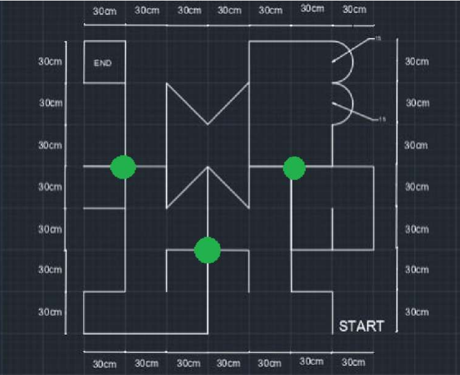

# TechFest_Meshmerize

# Line Follower Robot (Maze Solving Robot)  
An MSR (maze solving robot) is a clever little gadget with a silicon brain that finds its way through an arbitrary maze. It competes against other members of its species, racing as fast as it can. Here MSR is an electro-mechanical device, typically consisting of three main subsystems. They are drive system, an array of sensors, and the control system.

The drive system consists of a mechanical chassis, a set of motors, gears and wheels. The chassis is usually designed to operate like a wheel-chair, with two large drive wheels on either side of a lightweight aluminium frame. The chassis is built to house the motors, gear system, batteries, and circuitry, and must also be small enough to manoeuvre within the constraints of the maze.

# Components Of Robot
- Arudino Nano
- 7 sensor IR Array
- Motors
- Wheels
- Motor Drivers

  

* # Resources
    - [Medium Article]( https://towardinfinity.medium.com/coding-a-line-follower-robot-using-lsrb-and-finding-the-shortest-path-d906ffec71d)
    - [Repository 1](https://github.com/Chamal-Peiris/arduino-line-follow-robot-with-pid-algorithm/blob/main/pid%20line%20follow.ino#L26)
    - [Repository 2](https://github.com/utk7arsh/Autonomous-LFR-EE3-Spring-2022/blob/main/PID_car_code.ino)
    - [Repository - Meshmerize](https://github.com/HuCode-Geek/Meshmerize.git)
	- [Website](https://embedjournal.com/shortest-path-line-follower-robot-logic-revealed/#:~:text=The%20secret%20behind%20the%20shortest,remembering%20and%20some%20are%20not)

 

# LSRB Algorithm
This LSRB algorithm can be simplified into these simple conditions:

If you can turn left then go ahead and turn left,
else if you can continue driving straight then drive straight,
else if you can turn right then turn right.
If you are at a dead end then turn around.
 <b>
The expunction of LSRB is shown below:
- L- Left
- R- Right
- S- Straight
- B- Turning around (Back).</b>  
The robot has to make these decisions when at an intersection. An intersection is any point on the maze where you have the opportunity to turn. If the robot comes across an opportunity to turn and does not turn then this is considered going straight. Each move was taken at an intersection or when turning around has to be stored.  

<b>
The travelling is simplifying the register value using the following equation and shorted and follow the value of the register the equations are shown below,

LBR = B

LBS = R

RBL = B

SBL = R

SBS = B

LBL = S<b>

## Sample Path
The sample path for the competition   

## Check Points

